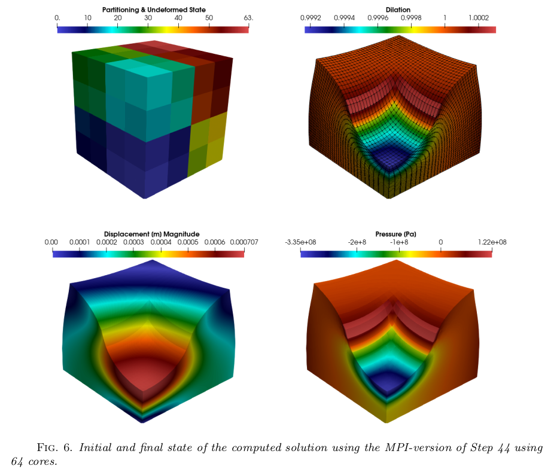
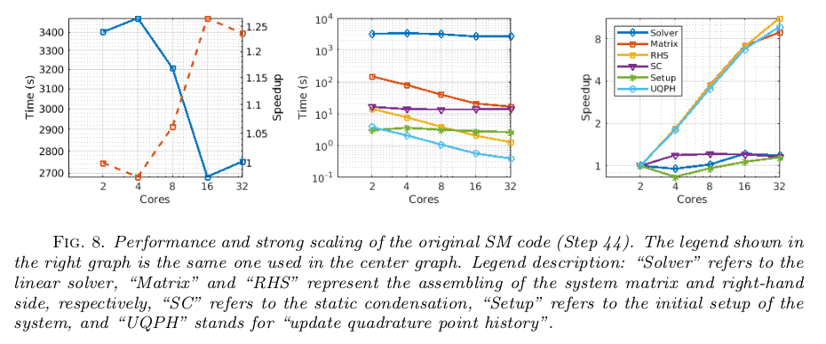
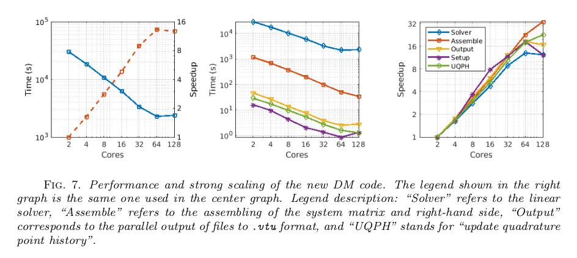

> Main file: `trilinos-parallel-step-44.cc`

# parallel-step-44: an MPI-based version of deal.II's step-44

Recent advances in understanding how muscles deform have led to a new, more informative mathematical model that views muscles as composite biomaterials, drawing a connection to the deformation of solids. This model is based on a three-dimensional, highly nonlinear system of partial differential equations. The current numerical approximation uses a second-order finite element method, in which the assembling process is done using the WorkStream design pattern in a shared-memory environment. Unfortunately, the degrees of freedom in the system can quickly grow to the point where the memory of a machine may not store such an amount of information, or that it may take too long for the linear system to solve. This is especially true when the mesh is constructed from magnetic resonance imaging (MRI) data. 

In this work, a parallel solver for quasi-static skeletal muscle deformation is discussed. As a stepping stone, a distributed version of a solver for Neo-Hookean solid deformation is constructed and scaling analyses are performed on this code. This new code is designed to run on a distributed architecture, building upon the existing deal.II implementation. The decomposition of the mesh is achieved through the p4est library, while the solution of the corresponding system of equations is coded using the Trilinos library. We also describe an updated script that can be used to install deal.II and link all the necessary dependencies.

See the report (`project-report.pdf`) for more details!

## Scaling before parallelization

## Scaling after parallelization

